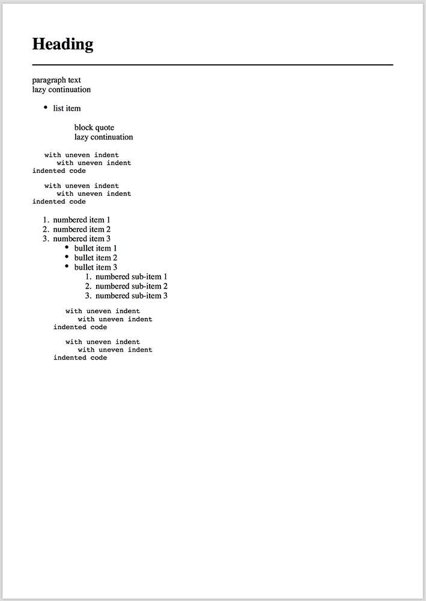

- [通过Gradle构建](#building-via-gradle)
- [使用Android Studio构建](#building-with-android-studio)
- [解析并渲染为HTML](#parse-and-render-to-html)
- [使用访问者处理解析的节点](#use-avisitor-to-process-parsed-nodes)
- [通过属性提供程序自定义HTML属性](#customize-html-attributes-via-attribute-provider)
- [包含Markdown和HTML文件内容](#include-markdown-and-html-file-content)
- [使用格式选项将AST呈现为Markdown](#render-ast-as-markdown-with-formatting-options)
- [将HTML转换为PDF](#render-html-to-pdf)


对于Maven,将`flexmark-all`添加为依赖项,其中包括核心和所有模块。
以下示例:

```xml
<dependency>
    <groupId>com.vladsch.flexmark</groupId>
    <artifactId>flexmark-all</artifactId>
    <version>0.62.2</version>
</dependency>
```

#### 通过Gradle构建

```shell
compile 'com.vladsch.flexmark:flexmark-all:0.62.2'
```

#### 使用Android Studio构建

由于文件重复而导致的其他设置:

```
packagingOptions {
    exclude 'META-INF/LICENSE-LGPL-2.1.txt'
    exclude 'META-INF/LICENSE-LGPL-3.txt'
    exclude 'META-INF/LICENSE-W3C-TEST'
}
```

请使用此处列出的代码,但可能会有些过时了。
使用链接获取最新版本。

### 解析并渲染为HTML

资源:
[ProfileEmulationFamilySamples.java](https://github.com/vsch/flexmark-java/blob/master/flexmark-java-samples/src/com/vladsch/flexmark/java/samples/ProfileEmulationFamilySamples.java)

```java
package com.vladsch.flexmark.samples;

import com.vladsch.flexmark.util.ast.Node;
import com.vladsch.flexmark.html.HtmlRenderer;
import com.vladsch.flexmark.parser.Parser;
import com.vladsch.flexmark.parser.ParserEmulationProfile;
import com.vladsch.flexmark.util.data.MutableDataHolder;
import com.vladsch.flexmark.util.data.MutableDataSet;

public class BasicSample {
    void commonMark() {
        Parser parser = Parser.builder().build();
        Node document = parser.parse("This is *Sparta*");
        HtmlRenderer renderer = HtmlRenderer.builder().build();
        renderer.render(document);  //"<p>This is <em>Sparta</em></p>\n"
    }

    void kramdown() {
        MutableDataSet options = new MutableDataSet();
        options.setFrom(ParserEmulationProfile.KRAMDOWN);
        options.set(Parser.EXTENSIONS, Arrays.asList(
                AbbreviationExtension.create(),
                DefinitionExtension.create(),
                FootnoteExtension.create(),
                TablesExtension.create(),
                TypographicExtension.create()
        ));

        Parser parser = Parser.builder(options).build();
        HtmlRenderer renderer = HtmlRenderer.builder(options).build();

        Node document = parser.parse("This is *Sparta*");
        renderer.render(document);  //"<p>This is <em>Sparta</em></p>\n"
    }

    void multiMarkdown() {
        MutableDataHolder options = new MutableDataSet();
        options.setFrom(ParserEmulationProfile.MULTI_MARKDOWN);

        Parser parser = Parser.builder(options).build();
        HtmlRenderer renderer = HtmlRenderer.builder(options).build();

        Node document = parser.parse("This is *Sparta*");
        renderer.render(document);  //"<p>This is <em>Sparta</em></p>\n"
    }

    void markdown() {
        MutableDataHolder options = new MutableDataSet();
        options.setFrom(ParserEmulationProfile.MARKDOWN);

        Parser parser = Parser.builder(options).build();
        HtmlRenderer renderer = HtmlRenderer.builder(options).build();

        Node document = parser.parse("This is *Sparta*");
        renderer.render(document);  //"<p>This is <em>Sparta</em></p>\n"
    }
}
```

这将使用具有默认选项的解析器和渲染器。两位建造者都有用于
配置其行为,例如在`HtmlRenderer`上调用`escapeHtml(true)`将转义为raw
HTML标记和块。有关所有可用选项,请参见构建器上的方法。

请注意,该库不会尝试清理生成的HTML。那是责任
来电者。

尽管其名称,commonmark既不是其他Markdown风味的超集也不是其子集。
相反,它为原始的"核心"提出了标准,明确的语法规范
Markdown,从而有效地引入了另一种风味。虽然flexmark是默认设置
符合commonmark,它的解析器可以通过各种方式进行调整。需要进行的一组调整
在flexmark中模拟最常用的markdown解析器,如下所示:
ParserEmulationProfiles。

顾名思义,`ParserEmulationProfile`只是将解析器调整为
特定的markdown风味。应用配置文件不会添加功能超出了
共同商标。如果您想使用flexmark来完全模拟另一个markdown处理器的行为,
您必须调整解析器并配置提供其他功能的flexmark扩展
要模拟的解析器中可用的功能。

###使用访客来处理已解析的节点

资源:
[VisitorSample.java](https://github.com/vsch/flexmark-java/blob/master/flexmark-java-samples/src/com/vladsch/flexmark/java/samples/VisitorSample.java)

```java
package com.vladsch.flexmark.samples;

import com.vladsch.flexmark.ast.Text;
import com.vladsch.flexmark.parser.Parser;
import com.vladsch.flexmark.util.ast.Node;
import com.vladsch.flexmark.util.ast.NodeVisitor;
import com.vladsch.flexmark.util.ast.VisitHandler;

@SuppressWarnings({ "unchecked", "WeakerAccess" })
public class VisitorSample {
    int wordCount;

    //example of visitor for a node or nodes, just add VisitHandlers<> to the list
    //any node type not handled by the visitor will default to visiting its children
    NodeVisitor visitor = new NodeVisitor(
            new VisitHandler<>(Text.class, this::visit)
    );

    public void visit(Text text) {
        //This is called for all Text nodes. Override other visit handlers for other node types.
        wordCount += text.getChars().unescape().split("\\W+").length;

        //Descending into children
        visitor.visitChildren(text);

        //Count words (this is just an example, don't actually do it this way for various reasons).
    }

    void countWords() {
        Parser parser = Parser.builder().build();
        Node document = parser.parse("Example\n=======\n\nSome more text");
        visitor.visit(document);

        System.out.println(wordCount);  //4
    }
}
```

###通过Attribute Provider自定义HTML属性

资源:
[AttributeProviderSample.java](https://github.com/vsch/flexmark-java/blob/master/flexmark-java-samples/src/com/vladsch/flexmark/java/samples/AttributeProviderSample.java)

```java
package com.vladsch.flexmark.samples;

import com.vladsch.flexmark.ast.AutoLink;
import com.vladsch.flexmark.util.ast.Node;
import com.vladsch.flexmark.ext.autolink.AutolinkExtension;
import com.vladsch.flexmark.html.AttributeProvider;
import com.vladsch.flexmark.html.AttributeProviderFactory;
import com.vladsch.flexmark.html.HtmlRenderer;
import com.vladsch.flexmark.html.IndependentAttributeProviderFactory;
import com.vladsch.flexmark.html.renderer.AttributablePart;
import com.vladsch.flexmark.html.renderer.NodeRendererContext;
import com.vladsch.flexmark.parser.Parser;
import com.vladsch.flexmark.util.html.Attributes;
import com.vladsch.flexmark.util.data.MutableDataHolder;
import com.vladsch.flexmark.util.data.MutableDataSet;import org.jetbrains.annotations.NotNull;

import java.util.Arrays;import java.util.Collections;

public class AttributeProviderSample {
    static class SampleExtension implements HtmlRenderer.HtmlRendererExtension {
        @Override
        public void rendererOptions(@NotNull final MutableDataHolder options) {
            //add any configuration settings to options you want to apply to everything, here
        }

        @Override
        public void extend(final HtmlRenderer.Builder rendererBuilder, @NotNull final String rendererType) {
            rendererBuilder.attributeProviderFactory(SampleAttributeProvider.Factory());
        }

        static SampleExtension create() {
            return new SampleExtension();
        }
    }

    static class SampleAttributeProvider implements AttributeProvider {
        @Override
        public void setAttributes(@NotNull final Node node, @NotNull final AttributablePart part, @NotNull final Attributes attributes) {
            if (node instanceof AutoLink && part == AttributablePart.LINK) {
                //Put info in custom attribute instead
                attributes.replaceValue("class", "my-autolink-class");
            }
        }

        static AttributeProviderFactory Factory() {
            return new IndependentAttributeProviderFactory() {
                @Override
                public AttributeProvider create(NodeRendererContext context) {
                    //noinspection ReturnOfInnerClass
                    return new SampleAttributeProvider();
                }
            };
        }
    }

    static String commonMark(String markdown) {
        MutableDataHolder options = new MutableDataSet();
        options.set(Parser.EXTENSIONS, Collections.singletonList(new Extension[] { AutolinkExtension.create(), SampleExtension.create() }));

        //change soft break to hard break
        options.set(HtmlRenderer.SOFT_BREAK, "<br/>");

        Parser parser = Parser.builder(options).build();
        Node document = parser.parse(markdown);
        HtmlRenderer renderer = HtmlRenderer.builder(options).build();
        final String html = renderer.render(document);
        return html;
    }

    public static void main(String[] args) {
        String html = commonMark("http://github.com/vsch/flexmark-java");
        System.out.println(html); //output: <p><a href="http://github.com/vsch/flexmark-java" class="my-autolink-class">http://github.com/vsch/flexmark-java</a></p>

        html = commonMark("hello\nworld");
        System.out.println(html); //output: <p>hello<br/>world</p>
    }
}
```

###包括Markdown和HTML文件内容

资源:
[JekyllIncludeFileSample.java](https://github.com/vsch/flexmark-java/blob/master/flexmark-java-samples/src/com/vladsch/flexmark/java/samples/JekyllIncludeFileSample.java)

Jekyll标记扩展名可用于使用``语法包含内容。
尽管扩展名实际上不包括文件,因为此操作是应用程序
依赖,它确实提供了使您的应用程序轻松添加此内容所需的一切
功能。

在下面的代码中,哈希映射用于文件到文件的内容映射,其中包括
您自己的代码,将包含的文件名解析为实际内容,并确定文件是否
需要将markdown转换为HTML,或者应原样包含。

Markdown包含示例是有效的:

*包含的文件`test.md`

  ```markdown
  ## Included Heading

  Included paragraph

  [ref]: http://example.com
  ```

*主要文件

  ```markdown
  http://github.com/vsch/flexmark-java

  [ref]

  
  ```

*渲染HTML

  ```html
  <p><a href="http://github.com/vsch/flexmark-java">http://github.com/vsch/flexmark-java</a></p>
  <p><a href="http://example.com">ref</a></p>
  <h2>Included Heading</h2>
  <p>Included paragraph</p>
  ```

原始内容包括样本是有效的:

*包含的文件`test.html`

  ```html
  <p>some text</p>
  ```

*主要文件

  ```markdown
  http://github.com/vsch/flexmark-java

  [ref]

  
  ```

*渲染HTML

  ```html
  <p><a href="http://github.com/vsch/flexmark-java">http://github.com/vsch/flexmark-java</a></p>
  <p>[ref]</p>
  <p>some text</p>
  ```

```java
package com.vladsch.flexmark.samples;

import com.vladsch.flexmark.ext.autolink.AutolinkExtension;
import com.vladsch.flexmark.ext.jekyll.tag.JekyllTag;
import com.vladsch.flexmark.ext.jekyll.tag.JekyllTagExtension;
import com.vladsch.flexmark.html.HtmlRenderer;
import com.vladsch.flexmark.parser.Parser;
import com.vladsch.flexmark.util.ast.Document;
import com.vladsch.flexmark.util.data.MutableDataHolder;
import com.vladsch.flexmark.util.data.MutableDataSet;

import java.util.Collections;
import java.util.HashMap;
import java.util.List;
import java.util.Map;

public class JekyllIncludeFileSample {
    static String commonMark(String markdown, Map<String, String> included) {
        MutableDataHolder options = new MutableDataSet();
        options.set(Parser.EXTENSIONS, Collections.singletonList(new Extension[] { AutolinkExtension.create(), JekyllTagExtension.create() }));

        //change soft break to hard break
        options.set(HtmlRenderer.SOFT_BREAK, "<br/>");

        Parser parser = Parser.builder(options).build();
        HtmlRenderer renderer = HtmlRenderer.builder(options).build();

        Document document = parser.parse(markdown);

        //see if document has includes
        Document doc = document;
        if (doc.contains(JekyllTagExtension.TAG_LIST)) {
            List<JekyllTag> tagList = JekyllTagExtension.TAG_LIST.get(doc);
            Map<String, String> includeHtmlMap = new HashMap<String, String>();

            for (JekyllTag tag : tagList) {
                String includeFile = tag.getParameters().toString();
                if (tag.getTag().equals("include") && !includeFile.isEmpty() && !includeHtmlMap.containsKey(includeFile)) {
                    //see if it exists
                    if (included.containsKey(includeFile)) {
                        //have the file
                        String text = included.get(includeFile);

                        if (includeFile.endsWith(".md")) {
                            Document includeDoc = parser.parse(text);
                            String includeHtml = renderer.render(includeDoc);
                            includeHtmlMap.put(includeFile, includeHtml);

                            //copy any definition of reference elements from included file to our document
                            parser.transferReferences(doc, includeDoc, null);
                        } else {
                            includeHtmlMap.put(includeFile, text);
                        }
                    }
                }

                if (!includeHtmlMap.isEmpty()) {
                    doc.set(JekyllTagExtension.INCLUDED_HTML, includeHtmlMap);
                }
            }
        }

        String html = renderer.render(document);
        return html;
    }

    public static void main(String[] args) {
        Map<String, String> included = new HashMap<>();
        included.put("test.md", "## Included Heading\n" +
                "\n" +
                "Included paragraph\n" +
                "\n" +
                "[ref]: http://example.com\n" +
                "");

        included.put("test.html", "<p>some text</p>\n" +
                "");

        String html = commonMark("http://github.com/vsch/flexmark-java\n" +
                "\n" +
                "[ref]\n" +
                "\n" +
                "\n" +
                "\n" +
                "", included);
        System.out.println(html);

        html = commonMark("http://github.com/vsch/flexmark-java\n" +
                "\n" +
                "[ref]\n" +
                "\n" +
                "\n" +
                "\n" +
                "", included);
        System.out.println(html);
    }
}
```

###使用格式选项将AST渲染为Markdown

资源:
[PegdownToCommonMark.java](https://github.com/vsch/flexmark-java/blob/master/flexmark-java-samples/src/com/vladsch/flexmark/java/samples/PegdownToCommonMark.java)。

`flexmark-formatter`模块使用各种格式设置选项将AST呈现为markdown
清理并使源一致。它还带有一个API,允许扩展
提供格式化选项,并处理自定义节点的markdown渲染。

`Formatter`类是一个渲染器,它输出markdown并将其格式化为指定的选项。
使用它代替`HtmlRenderer`以获得格式化的markdown。它也可以用来转换
从一个`ParserEmulationProfile`到另一个的缩进:

```java
package com.vladsch.flexmark.samples;

import com.vladsch.flexmark.util.ast.Node;
import com.vladsch.flexmark.formatter.Formatter;
import com.vladsch.flexmark.parser.Parser;
import com.vladsch.flexmark.profile.pegdown.Extensions;
import com.vladsch.flexmark.profile.pegdown.PegdownOptionsAdapter;
import com.vladsch.flexmark.util.data.DataHolder;
import com.vladsch.flexmark.util.data.MutableDataSet;

public class PegdownToCommonMark {
     final private static DataHolder OPTIONS = PegdownOptionsAdapter.flexmarkOptions(
            Extensions.ALL
    );

    static final MutableDataSet FORMAT_OPTIONS = new MutableDataSet();
    static {
        //copy extensions from Pegdown compatible to Formatting
        FORMAT_OPTIONS.set(Parser.EXTENSIONS, Parser.EXTENSIONS.get(OPTIONS));
    }

    static final Parser PARSER = Parser.builder(OPTIONS).build();
    static final Formatter RENDERER = Formatter.builder(FORMAT_OPTIONS).build();

    //use the PARSER to parse and RENDERER to parse pegdown indentation rules and render CommonMark

    public static void main(String[] args) {
        final String pegdown = "#Heading\n" +
                "-----\n" +
                "paragraph text \n" +
                "lazy continuation\n" +
                "\n" +
                "* list item\n" +
                "    > block quote\n" +
                "    lazy continuation\n" +
                "\n" +
                "~~~info\n" +
                "        with uneven indent\n" +
                "           with uneven indent\n" +
                "     indented code\n" +
                "~~~ \n" +
                "\n" +
                "        with uneven indent\n" +
                "           with uneven indent\n" +
                "     indented code\n" +
                "1. numbered item 1   \n" +
                "1. numbered item 2   \n" +
                "1. numbered item 3   \n" +
                "    - bullet item 1   \n" +
                "    - bullet item 2   \n" +
                "    - bullet item 3   \n" +
                "        1. numbered sub-item 1   \n" +
                "        1. numbered sub-item 2   \n" +
                "        1. numbered sub-item 3   \n" +
                "    \n" +
                "    ~~~info\n" +
                "            with uneven indent\n" +
                "               with uneven indent\n" +
                "         indented code\n" +
                "    ~~~ \n" +
                "    \n" +
                "            with uneven indent\n" +
                "               with uneven indent\n" +
                "         indented code\n" +
                "";
        System.out.println("pegdown\n");
        System.out.println(pegdown);

        Node document = PARSER.parse(pegdown);
        String commonmark = RENDERER.render(document);

        System.out.println("\n\nCommonMark\n");
        System.out.println(commonmark);
    }
}
```

将pegdown 4空格缩进转换为CommonMark列表项文本列缩进。

##### Pegdown input

    #Heading
    -----
    paragraph text
    lazy continuation

    * list item
        > block quote
        lazy continuation

    ~~~info
            with uneven indent
               with uneven indent
         indented code
    ~~~

            with uneven indent
               with uneven indent
         indented code
    1. numbered item 1
    1. numbered item 2
    1. numbered item 3
        - bullet item 1
        - bullet item 2
        - bullet item 3
            1. numbered sub-item 1
            1. numbered sub-item 2
            1. numbered sub-item 3

        ~~~info
                with uneven indent
                   with uneven indent
             indented code
        ~~~

                with uneven indent
                   with uneven indent
             indented code

##### CommonMark output

转换为CommonMark缩进,添加了ATX标题空间,添加了空行,用了围栏和
缩进的代码缩进最小化:

    # Heading

    -----

    paragraph text
    lazy continuation

    * list item

      > block quote
      > lazy continuation

    ~~~info
       with uneven indent
          with uneven indent
    indented code
    ~~~

           with uneven indent
              with uneven indent
        indented code

    1. numbered item 1
    2. numbered item 2
    3. numbered item 3
       - bullet item 1
       - bullet item 2
       - bullet item 3
         1. numbered sub-item 1
         2. numbered sub-item 2
         3. numbered sub-item 3

       ~~~info
          with uneven indent
             with uneven indent
       indented code
       ~~~

              with uneven indent
                 with uneven indent
           indented code

### 将HTML渲染为PDF

资源:
[PdfConverter.java](https://github.com/vsch/flexmark-java/blob/master/flexmark-java-samples/src/com/vladsch/flexmark/java/samples/PdfConverter.java)

`flexmark-pdf-converter`模块使用以下命令将HTML呈现为PDF
[打开HTML到PDF](https://github.com/danfickle/openhtmltopdf)

```java
package com.vladsch.flexmark.samples;

import com.vladsch.flexmark.util.ast.Node;
import com.vladsch.flexmark.html.HtmlRenderer;
import com.vladsch.flexmark.parser.Parser;
import com.vladsch.flexmark.parent.PdfConverterExtension;
import com.vladsch.flexmark.profile.pegdown.Extensions;
import com.vladsch.flexmark.profile.pegdown.PegdownOptionsAdapter;
import com.vladsch.flexmark.util.data.DataHolder;
import org.apache.commons.io.IOUtils;

import java.io.IOException;
import java.io.InputStream;
import java.io.StringWriter;

public class PdfConverter {
    static final DataHolder OPTIONS = PegdownOptionsAdapter.flexmarkOptions(
            Extensions.ALL & ~(Extensions.ANCHORLINKS | Extensions.EXTANCHORLINKS_WRAP)
    ).toImmutable();

    static String getResourceFileContent(String resourcePath) {
        StringWriter writer = new StringWriter();
        getResourceFileContent(writer, resourcePath);
        return writer.toString();
    }

    private static void getResourceFileContent(final StringWriter writer, final String resourcePath) {
        InputStream inputStream = com.vladsch.flexmark.java.samples.PdfConverter.class.getResourceAsStream(resourcePath);
        try {
            IOUtils.copy(inputStream, writer, "UTF-8");
            inputStream.close();
        } catch (IOException e) {
            e.printStackTrace();
        }
    }

    public static void main(String[] args) {
        final String pegdown = "#Heading\n" +
                "-----\n" +
                "paragraph text \n" +
                "lazy continuation\n" +
                "\n" +
                "* list item\n" +
                "    > block quote\n" +
                "    lazy continuation\n" +
                "\n" +
                "~~~info\n" +
                "   with uneven indent\n" +
                "      with uneven indent\n" +
                "indented code\n" +
                "~~~ \n" +
                "\n" +
                "       with uneven indent\n" +
                "          with uneven indent\n" +
                "    indented code\n" +
                "1. numbered item 1   \n" +
                "1. numbered item 2   \n" +
                "1. numbered item 3   \n" +
                "    - bullet item 1   \n" +
                "    - bullet item 2   \n" +
                "    - bullet item 3   \n" +
                "        1. numbered sub-item 1   \n" +
                "        1. numbered sub-item 2   \n" +
                "        1. numbered sub-item 3   \n" +
                "    \n" +
                "    ~~~info\n" +
                "       with uneven indent\n" +
                "          with uneven indent\n" +
                "    indented code\n" +
                "    ~~~ \n" +
                "    \n" +
                "           with uneven indent\n" +
                "              with uneven indent\n" +
                "        indented code\n" +
                "";
        System.out.println("pegdown\n");
        System.out.println(pegdown);

        final Parser PARSER = Parser.builder(OPTIONS).build();
        final HtmlRenderer RENDERER = HtmlRenderer.builder(OPTIONS).build();

        Node document = PARSER.parse(pegdown);
        String html = RENDERER.render(document);

        html = "<!DOCTYPE html><html><head><meta charset=\"UTF-8\">\n" +
         "\n" +  //add your stylesheets, scripts styles etc.
         "</head><body>" + html + "\n" +
         "</body></html>";

        PdfConverterExtension.exportToPdf("~/flexmark-java.pdf", html,"", OPTIONS);
    }
}
```

##### Pegdown Markdown输入

    #Heading
    -----
    paragraph text
    lazy continuation

    * list item
        > block quote
        lazy continuation

    ~~~info
       with uneven indent
          with uneven indent
    indented code
    ~~~

           with uneven indent
              with uneven indent
        indented code
    1. numbered item 1
    1. numbered item 2
    1. numbered item 3
        - bullet item 1
        - bullet item 2
        - bullet item 3
            1. numbered sub-item 1
            1. numbered sub-item 2
            1. numbered sub-item 3

        ~~~info
           with uneven indent
              with uneven indent
        indented code
        ~~~

               with uneven indent
                  with uneven indent
            indented code

##### PDF输出

[flexmark-java.pdf](resources/flexmark-java.pdf)



有关渲染非拉丁字符集的详细信息,请参见[PDF Renderer Converter](ext/PDF-Renderer-Converter)